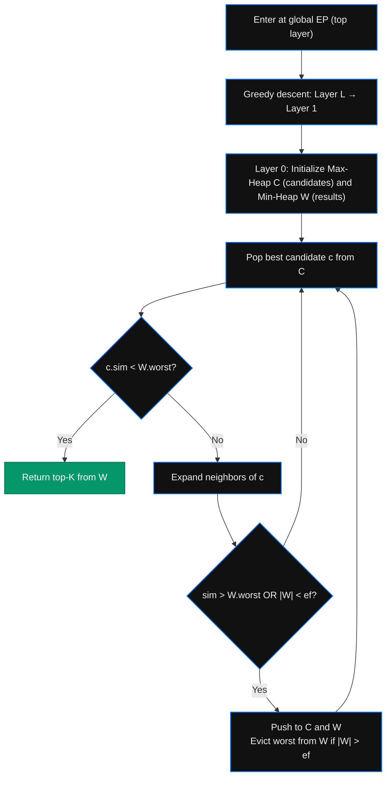

<div align="center">

  
  
  
  

  <h1>VectorLens</h1>
  <p><b>A mathematically rigorous, 3D interactive visualization of the HNSW algorithm — the same index powering Pinecone, Qdrant, and Weaviate.</b></p>

  <a href="https://hnsw-vector-search-visualizer.vercel.app/">
    
  </a>

</div>

---

## What is VectorLens?

Every RAG pipeline, every semantic search, every AI recommendation runs through an **Approximate Nearest Neighbor (ANN)** index at its core. VectorLens is a production-grade engineering tool that visualizes **how** that index works, step by step, in real time.

The engine is built to the Malkov (2016) HNSW specification — not a simulation or approximation of it. The graph is constructed using sequential node insertion, the search uses a binary-heap Priority Queue, and the traversal descends actual hierarchical layers. There are no "demo cheats" or hardcoded shortcuts.

---

## Live Demo

**[https://hnsw-vector-search-visualizer.vercel.app/](https://hnsw-vector-search-visualizer.vercel.app/)**

Click a query chip on the onboarding screen to instantly run an HNSW search. Watch the algorithm descend from Layer 2 → Layer 1 → Layer 0 in the 3D graph, with live cosine similarity calculations updating the Math Inspector at every hop.

---

## Features

- **True HNSW Index** — Graph is built via sequential node insertion exactly as in the Malkov (2016) paper. Each node is assigned a random layer height using the exponentially decaying probability $\frac{1}{\ln(M)}$, creating the genuine hierarchical small-world structure.
- **Priority Queue Traversal** — The `efSearch` layer-0 pass uses a binary-heap min/max `PriorityQueue` class (zero dependencies), not an array sort. The candidate pool and result set are maintained as proper heaps.
- **Multi-Layer Descent** — The search starts at the global entry point and descends coarsely through upper layers before switching to the full priority-queue sweep at Layer 0, exactly matching the HNSW specification.
- **Brute Force Comparison** — Toggle to $\mathcal{O}(N)$ exhaustive scan to visually compare how many nodes are evaluated vs. the approximate path.
- **3D Canvas Renderer** — Custom perspective projection with depth-of-field opacity, directional gradient traversal paths, and a precision crosshair for the query point.
- **Live Math Inspector** — Dot product, vector norms, and cosine similarity animate in real time as each node is evaluated.
- **Cinematic Camera** — Slow ambient orbit at idle, auto-focus tracking during search, and full reveal on completion. Drag empty space to pan; drag near nodes to rotate.
- **Mobile Responsive** — Full layout at 768px breakpoint; HUD stacks vertically on small screens.

---

## Algorithm Architecture

### Graph Construction (Sequential Insertion)

Each node `q` is inserted by:
1. Assigning a random max-layer: `l = floor(-ln(rand) × mL)`
2. Descending from the global entry point to layer `l+1` with greedy best-first search
3. At each layer `lc ≤ l`, running a bounded `efConstruction` search to find the `M` (or `M₀` at layer 0) nearest neighbors
4. Forming bidirectional links; pruning over-connected nodes via heuristic selection

### Search (Priority Queue Traversal)



---

## Technical Notes

| Parameter | Value | Notes |
|---|---|---|
| Nodes | 300 | 10 semantic clusters, 30 nodes each |
| Embedding dims | 32 | Cluster-coherent synthetic embeddings |
| M (max links / layer) | 5 | Neighbors per node in upper layers |
| M₀ (base layer links) | 10 | Neighbors per node in layer 0 |
| efConstruction | 30 | Candidate pool size during graph build |
| efSearch | 32 | Candidate pool size during query |
| Layers | 2–3 | Probabilistically assigned per node |

---

## Quick Start

```bash
git clone https://github.com/ManikBodamwad/HNSW_Vector_Search_Visualizer.git
cd HNSW_Vector_Search_Visualizer/frontend
npm install
npm run dev
```

Navigate to `http://localhost:5173` and click a query chip to run a search.

---

## Stack

- **React 18** — UI shell, state management
- **HTML5 Canvas (2D)** — Custom 3D perspective renderer, no WebGL
- **Vite** — Build toolchain
- **Vercel** — Hosting (static CDN, zero backend)
- **Zero external algorithm dependencies** — HNSW engine, Priority Queue, and cosine similarity are all hand-rolled JavaScript

---

## Author

Built by **Manik Bodamwad** to bridge the gap between "I've heard of vector databases" and "I understand exactly how the index works."

- 📧 [manikwork24@gmail.com](mailto:manikwork24@gmail.com)
- 💼 [LinkedIn](https://www.linkedin.com/in/manik-bodamwad-814b331a6/)
- 🐙 [GitHub](https://github.com/ManikBodamwad)
