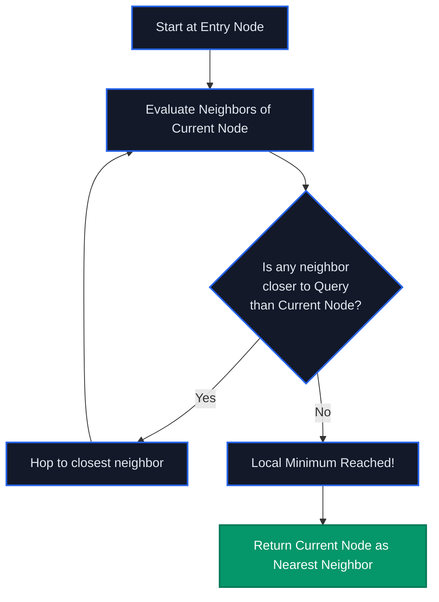

<div align="center">
  
  
  

  <h1>VectorLens</h1>
  <p><b>Interactive 3D Visualization of the Hierarchical Navigable Small World (HNSW) Algorithm</b></p>
</div>

---

## 👁️ What is VectorLens?

VectorLens is a high-performance, 3D-accelerated engineering tool designed to demystify **Approximate Nearest Neighbor (ANN)** searches.

Modern AI applications—from Retrieval-Augmented Generation (RAG) to Semantic Search—rely on Vector Databases like Pinecone, Qdrant, and Weaviate. Under the hood, these databases use the **Hierarchical Navigable Small World (HNSW)** algorithm to perform massive scale, lightning-fast vector similarity lookups in $\mathcal{O}(\log N)$ time.

VectorLens provides a live, Bloomberg-terminal inspired, fully interactive 3D visualization of this algorithm executing in real-time, allowing engineers and students to visually debug and understand vector traversal, greedy routing, and cosine similarity.

---

## 🚀 Features

- **3D Perspective Rendering**: A custom HTML5 Canvas engine calculates Z-depth, scaling, and rotation to present the vector space in an immersive 3D environment.
- **Real-Time Math Inspector**: Live tracking of Dot Products, Vector Norms, and Cosine Similarity equations as the algorithm evaluates nodes.
- **Traversal Log**: Real-time auditing of greedy search routing, showing "entry points", "hops", and "evaluations".
- **HNSW vs. Brute Force Comparison**: Toggle between $\mathcal{O}(\log N)$ HNSW heuristic routing and $\mathcal{O}(N)$ exhaustive search to visualize the computational savings.
- **Zero Dependencies**: The 3D renderer is built entirely from scratch on vanilla `CanvasRenderingContext2D` to ensure maximum performance without heavy WebGL overhead.

---

## 🧠 Understanding the Visualization

When you execute a search in VectorLens, you will see the graph evaluate and traverse nodes. Here is what is happening:

### The Color Code (What are the dots?)
- 🔵 **Blue Dot (Entry & Hops):** The algorithm enters the graph at a random or pre-determined top-layer node and "hops" to neighbors that are closer to the query.
- ⚪️ **White Dots (Evaluated):** Nodes that the algorithm checked (calculating Cosine Similarity) but discarded because they weren't closer than the current path.
- 🟢 **Green Dot (Result):** The algorithm has reached a local minimum where no connected neighbor is closer to the query. This is your **Nearest Neighbor**.
- 💫 **Glowing Edges:** The explicit path the search algorithm took through the Small World graph to reach the target.

### Why are some nodes skipped entirely?
HNSW relies on the **Small World** network property. Instead of checking all $N$ nodes (like Brute Force), it navigates long-distance "expressway" edges to rapidly jump toward the general vicinity of the target, and then uses short-distance edges to hone in. The nodes left dark were successfully pruned and skipped, saving massive amounts of compute.

---

## 📐 Algorithm Architecture (HNSW Routing)

The core traversal logic for a single layer in HNSW follows greedy routing:



---

## 🛠️ Quick Start

### Prerequisites
- Node.js (v18+)

### Installation

1. **Clone the repository**
   ```bash
   git clone https://github.com/ManikBodamwad/HNSW_Vector_Search_Visualizer.git
   cd HNSW_Vector_Search_Visualizer/frontend
   ```

2. **Install dependencies**
   ```bash
   npm install
   ```

3. **Run the development server**
   ```bash
   npm run dev
   ```

4. **Explore**
   Navigate to `http://localhost:5174` and click and drag to rotate the 3D graph!

---

## 👨‍💻 Author

Built by **Manik Bodamwad** to explore the intersection of high-performance rendering and AI search infrastructure.

- 📧 [manikwork24@gmail.com](mailto:manikwork24@gmail.com)
- 💼 [LinkedIn](https://www.linkedin.com/in/manik-bodamwad-814b331a6/)
- 🐙 [GitHub](https://github.com/ManikBodamwad)
